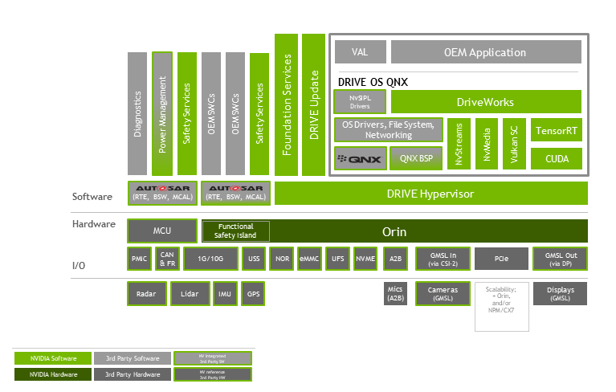
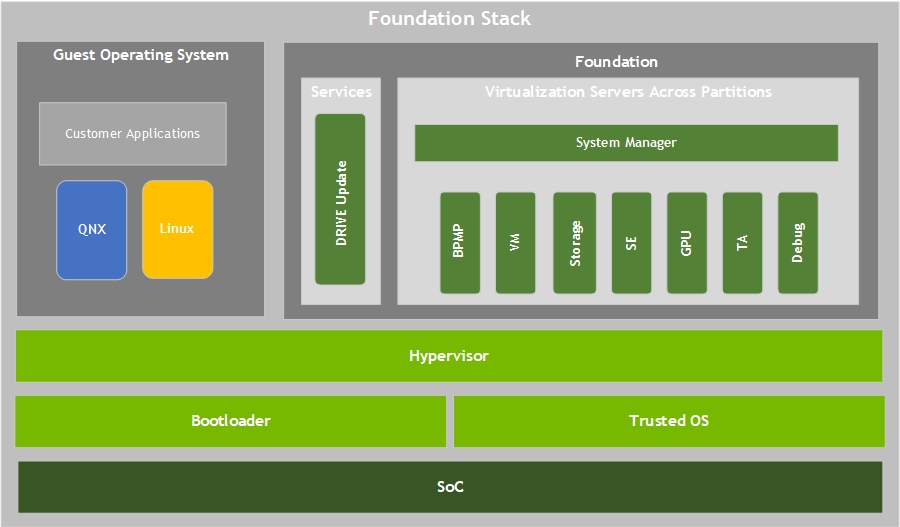

# Nvidia-OrinX Drive Demo

## introduce
The NVIDIA DRIVE® OS 6.0 Linux Software Development Kit enables application development with NVIDIA DRIVE Orin™ SoC for Automotive. At a high level.
Platform Software Stacks as follow


## Foundation Services Stack
The NVIDIA DRIVE AGX™ platform Foundation services runtime software stack provides the infrastructure for all the components of the platform


## PART I DriveOS SDK

### nvsipl_camera

### ijpg_encoder

### dla_sample

## PART II Driveworks

### driveworks-5.8

```sh
driveworks_5.8.82-317146970_amd64.deb
driveworks-samples_5.8.82-317146970_amd64.deb
driveworks-cgf_5.8.82-317146970_amd64.deb
driveworks-cgf-samples_5.8.82-317146970_amd64.deb
driveworks-cgf-doc_5.8.82-317146970_all.deb
driveworks-stm_5.8.82-317146970_amd64.deb
driveworks-stm-samples_5.8.82-317146970_amd64.deb

# driveworks-cgf-ui_5.8.82-317146970_amd64.deb
# driveworks-data_5.8.82-317146970_all.deb
```

### driveworks-5.10

```sh
driveworks_5.10.87-323457480_amd64.deb
driveworks-samples_5.10.87-323457480_amd64.deb
# driveworks-doc_5.10.87-323457480_all.deb
# cgf not found
# stm
driveworks-stm_5.10.87-323457480_amd64.deb
```

### 拷贝方法

```sh
# 多线程压缩解压缩
sudo apt install pigz

cd /gw_demo
tar --use-compress-program=pigz -h -cvpf  driveworks-5.10.tar.gz /usr/local/driveworks/*

tar --use-compress-program=pigz -xvpf driveworks-5.10.tar.gz
```
